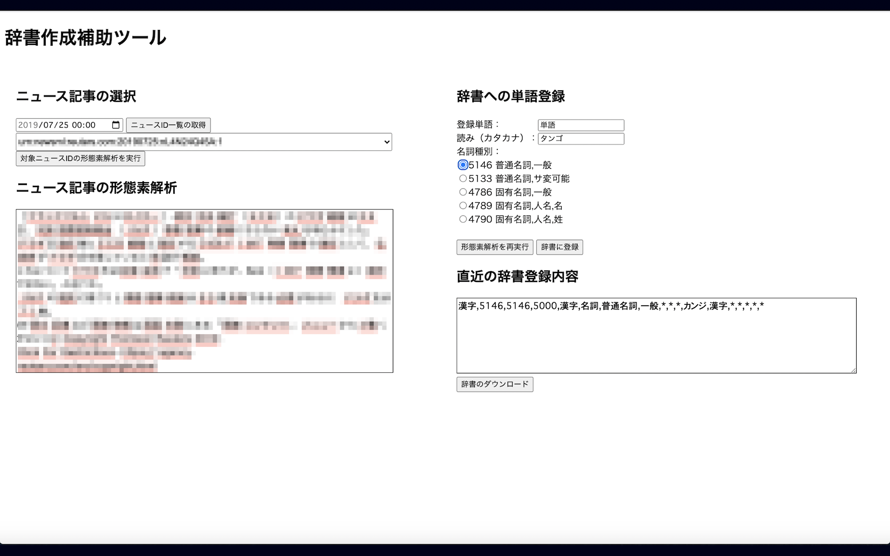

# 辞書作成補助ツール

## 概要

自然言語処理において、日本語の形態素解析器として
[Sudachi](https://github.com/WorksApplications/Sudachi#sudachi-日本語readme)など大変便利な物があります。しかし、ニッチな分野に対しては独自に辞書を作成した方が良いことがあり、さほどITに詳しくない人でも操作できるようなツールを作成しました。

ニュース等の文章を形態素解析して、その結果を確認しながら、うまく分割されていない単語（名詞）に対して辞書を作成することができます。

- 全体画面
  - 大きく4つに分かれています。
    - ニュース記事の選択
    - ニュース記事の形態素解析
    - 辞書への単語登録
    - 直近の辞書登録内容



- 形態素解析した文の表示(例)
  - 名詞と識別された単語は、わかりやすく色付けされます。

    

- ユーザ辞書そのものはCSV形式ですが、直接CSVファイルを編集するとオペレーションミスが発生しやすいです。ミスがあると、登録したつもりであるにも関わらず、正しく辞書登録されない状態となってしまうため、「単語・読み・名詞種別」の最低限、必要な項目のみを入力する形としています。

## 辞書作成の作業の流れ
1. ニュース記事の選択
    1. 特定の日時を指定して、「ニュースID一覧の取得」を押下します。
    1. 指定した日時のニュースがプルダウンにて選択可能となるので、IDを指定して、「対象ニュースIDの形態素解析を実行」を押下します。

1. ニュース記事の形態素解析
    1. 指定したニュースを形態素解析した結果が表示されます。

1. 辞書への単語登録
    1. 辞書登録したい単語に対して、以下を入力します。
        - 単語
        - 読み（カタカナ）
        - 名詞種別（普通名詞 or 固有名詞など）
    1. 「形態素解析を再実行」を押下して、解析結果が意図した通りになっている（登録したい単語が過不足なく分割されている）ことを確認します。
    1. 解析結果に問題がなければ、「辞書に登録」を押下して辞書登録します。

1. 直近の辞書登録内容
    1. 辞書登録した単語が表示されていることを確認します。
    1. 必要なタイミングで、「辞書のダウンロード」を押下して、csv形式で辞書をダウンロードします。


## 構成
- オープンソース日本語NLPライブラリの[GINZA](https**://megagonlabs.github.io/ginza/)を使用しています。
- ユーザ辞書作成方法の詳細は[Sudachi ユーザー辞書作成方法](https://github.com/WorksApplications/Sudachi/blob/develop/docs/user_dict.md)を参照してください。
- WEBフレームワークは Flask を採用し、シンプルで小規模な構成です。
- DBは PostgreSQL を採用し、python からは psycopg2 を使用してシンプルにアクセスしています。
- 上記の Flask と PostgreSQL はいずれもコンテナとしてします。両コンテナともDocker-Composeにより管理します。
- ブラウザでの見え方は Mac (10.15.6) の Chrome (ver.83) にて確認しています。

- ソフトウェアバージョン
  | 項目           | バージョン  |
  |:---------------|:----------|
  | ginza          | 3.1.2     |
  | spaCy          | 2.2.4     |
  | flask          | 1.1.2     |
  | psycopg2       | 2.8.5     |
  | postgresql     | 12.3      |
  | docker         | 19.03.8   |
  | docker-compose | 1.25.5    |


## デプロイ方法
### 事前準備（DB）
- ニュースデータはDBに保持しますが、各自で用意する必要があります。（ライセンスの関係で本レポジトリにはデータを含めることができませんでした。）
  - 例えば、[livedoor ニュースコーパス](http://www.rondhuit.com/download.html#ldcc)などが公開されており、とても便利です。（感謝）
  - ```psql_data```ディレクトリ（```PG_DATA```）にDBデータを構築します。postgresコンテナは```Volume```設定により、この領域を共有します。

- DBのテーブルスキーマは以下を前提としています。
  - ```news``` データベース
  - ```readonly_user``` ユーザ
  - ```news01``` テーブル
  ```sql
  CREATE TABLE news01 (
      versionCreated timestamp with time zone,
      storyId varchar(255),
      story text,
      primary key(storyId)
  ) ;
  ```

- flask側からは以下のようにアクセスしています。
  ```python:webapp.py(l.217)
              # get news from DB
              db_config = DBConfig(table='news01', user='readonly_user',  database='news')
  ```

- postgresql設定ファイルは最低限、以下の設定が必要です。
  - postgres.conf
  ```
  # さくさく動作させるためにメモリ割当量を増やします。
  shared_buffers = 1024MB
  ```

  - pg_hba.conf
  ```
  # flaskコンテナからのアクセスを許可します。（以下の設定は全ユーザ、全IPを許可）
  host    all             all             0.0.0.0/  0               trust
  ```


### docker および docker-composeをインストール（[公式手順](https://docs.docker.com/compose/install/)）
以下は　AWS EC2上に配置する場合の例です。
```
$ yum install docker -y
$ sudo systemctl start docker
$ sudo systemctl enable docker
$ sudo usermod -a -G docker ec2-user 
# 一度、ログアウトして入り直す。

$ sudo curl -L "https://github.com/docker/compose/releases/download/1.26.2/docker-compose-$(uname -s)-$(uname -m)" -o /usr/local/bin/docker-compose
$ sudo chmod +x /usr/local/bin/docker-compose
```

### 起動＿停止方法
- docker-composeで起動します。
  ```
  # git cloneしたディレクトリに移動
  cd make-dictionary-tool
  # コンテナ起動
  docker-compose up -d
  # コンテナ起動確認
  docker-compose ps
  ```
  chrome等のブラウザで ```localhost:15000``` （ローカルホスト上で起動している場合）にアクセスします。
  
  ポート番号は、```docker-compose.yml``` 内で指定しています。必要に応じて変更してください。

- docker-composeで停止します。
  ```
  # コンテナ停止
  docker-compose down
  ```
